# Low Fidelity Prototype

## Prototype Components
### What are the components?
The components of our low-fidelity prototype are a Discord server with channels for each of the tasks that Prioritize Bot, our Discord “Bot”, will be performing. We created three different channels, #keyword-user-notifications, #notification-alarms, and #bookmarks. The tasks of the Discord “Bot” were performed by one of our team members, who sent messages introducing the bot and possible message responses based on the commands that users can type.

### Keyword Notifications
Users can use the Discord “Bot” to set specific keywords that they want to keep track of in Discord messages to help them prioritize their notifications. Users can view the messages with the specific keywords in the #keyword-user-notifications channel. The Discord “Bot” also provides users with the ability to keep track of messages where the users were mentioned using @[username].

### Notification Alarms
Users can use the Discord “Bot” to set alarms on a message to help remind them to respond. Users can view the messages with notification alarms in the #notification-alarms channel. The user can specify a day and time for the alarm to deliver a reminder to respond to the message. Users can also add a comment to be displayed in the response reminder message when setting the notification alarm. The response reminder message can be viewed in the #notification-alarms channel.

### Bookmarks
Users can use the Discord “Bot” to bookmark messages from specific users to view later, receive notification summaries from specific channels, and view reminder updates which appear when a user has responded to a message after setting a notification alarm. All bookmarked messages, channel notification summaries, and reminder updates can be viewed in the #bookmarks channel. The concept of the #bookmarks channel is to provide one place where users can view saved content and updates.

## Wizardry Aspects of Our Prototype

For the wizardry parts of our prototype, one of our group members will act as the “bot” and type the message out. Certain features such as finding keywords, summarizing a channel, and notification alarms are wizardry and we’re manually doing all of these things rather than having a bot actually do it.

## Screenshots of Prototype

### Keyword/User Notification Bot

Keyword bot introduction message when you join the server:

Users can use /help for what features there are:
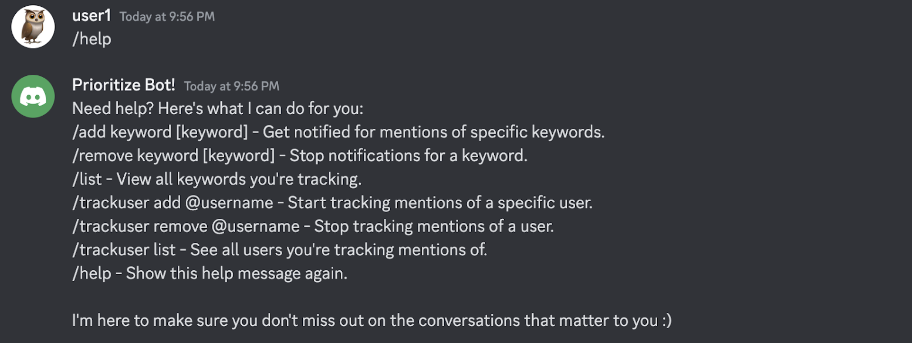

Users can add keyword (/add) or add the user (/trackuser) to track so they can be notified when they are mentioned:
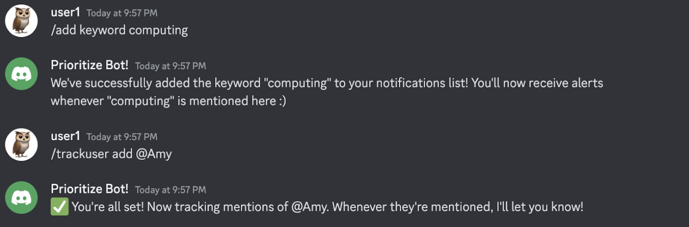

Users can list the keywords and users that are currently being tracked by the bot:
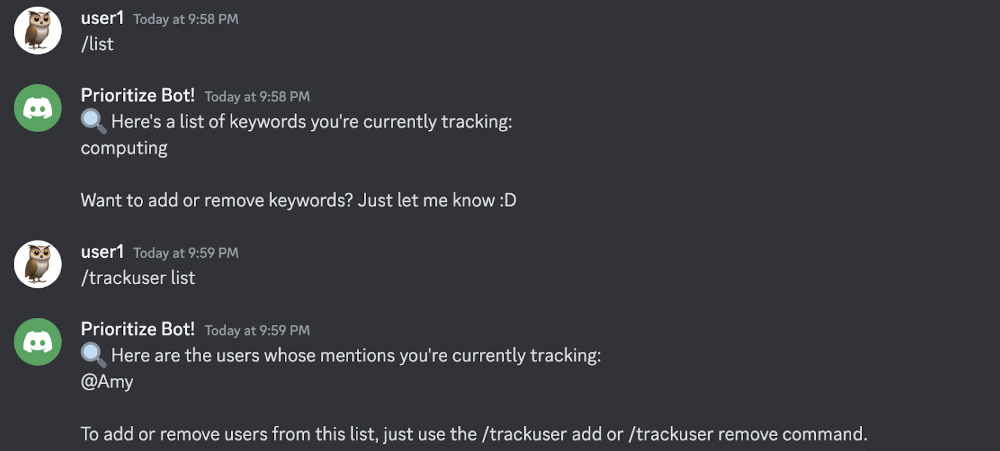

Users can remove keyword (/remove keyword) or remove the user (/trackuser remove) to track so they can be notified when they are mentioned:
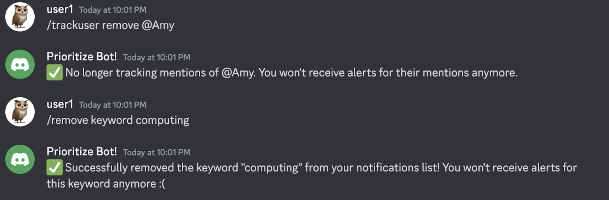

### Notification Alarm Bot
Prioritize bot introduction message when you join the server:

Users can use /help for what features there are:
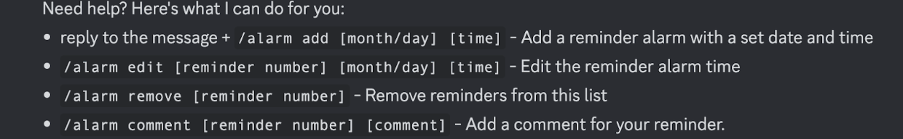

Set up an alarm for a specific message by replying that message with command /alarm add + date and time:
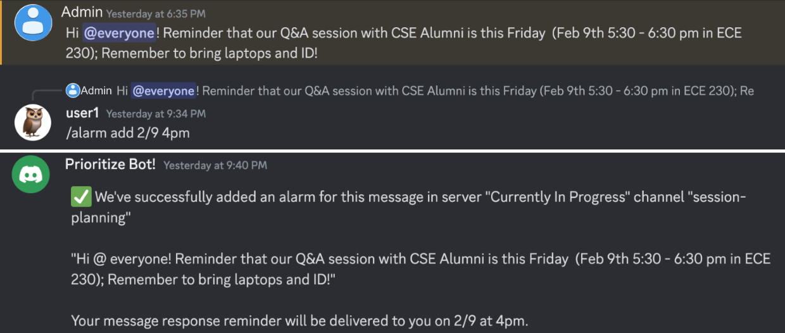

Users can check their reminders using the /remind command:
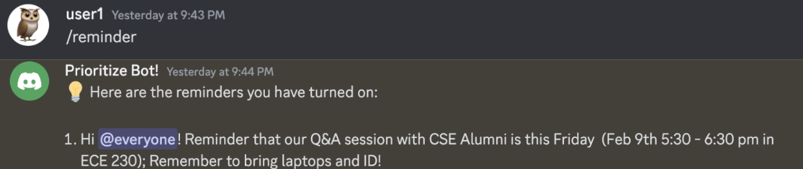

Users will get notifications at the set date and time:
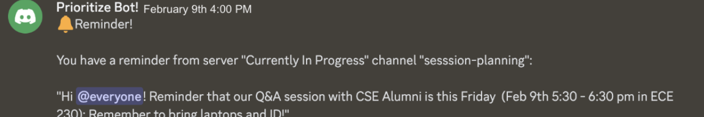

Users can edit the reminder using /alarm edit by mentioning the reminder number and new date and time:
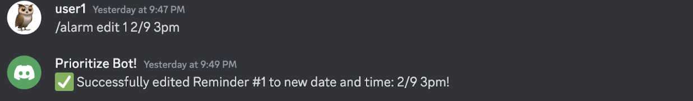

Users can remove the reminder by using /alarm remove and the reminder number:
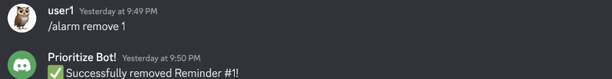

Users can add comments to the reminde with /alarm comment:
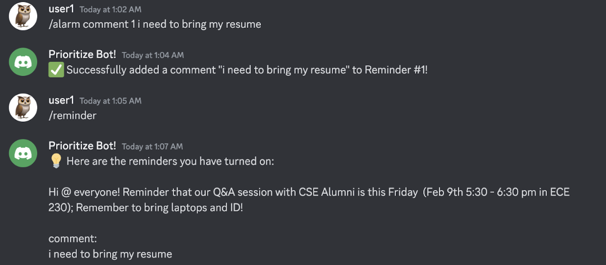

### Bookmarks Bot
Prioritize bot introduction message when you join the server:
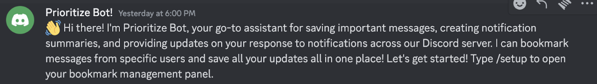

Users can use /help for what features there are:
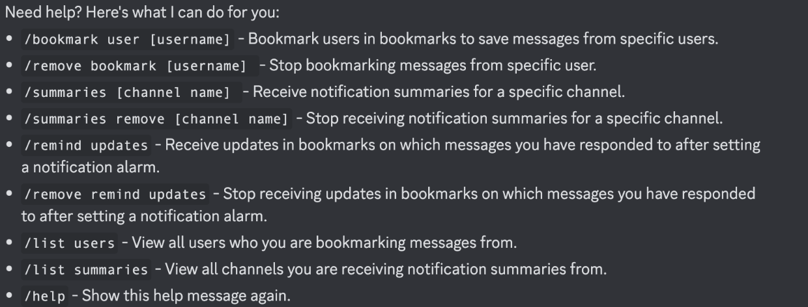

Users can save messages for specific users using /bookmark user:
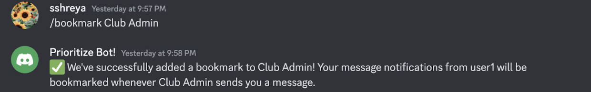

Users can receive notification summaries for a specific channel using /summaries:
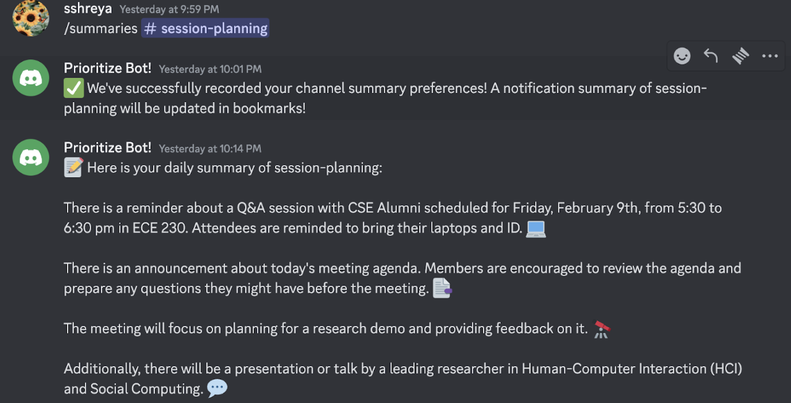

Users can unsubscribe summaries from a channel by using /summaries remove:
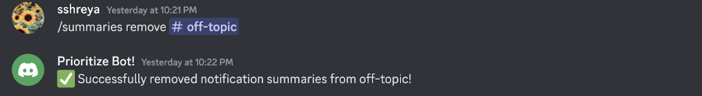

Users can receive updates in ⁠bookmarks on which messages you have responded to after setting a notification alarm:
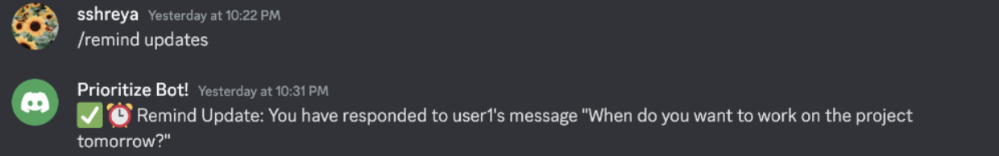

## User Testing
### Goals:
Our goal originally with our user testing was to help narrow down the functionalities we would have for our bot and find out in what ways that users would interact with it. We wanted to get a better understanding of the difficulties users may have along the way for understanding how the bot works and what to ask the bot to do. We recognized that a lot of times users want a functionality already set up for them to use rather than having to set it up themselves so we wanted to make the set-up process as smooth and seamless as possible for users.

We had a few different tasks such as typing the commands and navigating the different channels that we wanted users to become familiar with as they used the bot so they could understand the three main bot features we designed. With these three features, we wanted to find out which functionalities users wanted to see most and found most useful and applicable in their day-to-day lives for how they would like to prioritize their notifications. Not only that, we also wanted to pinpoint the actions or commands that users thought could be made more clear and helpful to use and understand.

### Findings From Wizard of Oz Testing
We conducted the Wizard of Oz session and learned that users had good feedback on the core functionalities of the Prioritize Bot, such as keyword notifications, reminder alarms, and bookmarking. We identified the areas that need improvement, such as clarity and efficiency, for example, the instructions are not clear enough for setting reminders and the instructions should be updated with more details. For example, the “/add comment” command for the reminders part is confusing and users did not think it was for labeling the message. Since we did the bot responses manually, they hope to have quicker and more automated responses. We also found that users prefer a user-friendly interface such as having a more visual display with examples to understand how to effectively use the bot, rather than only a text-based interface. 

### For the Future, Things to Keep:
We are interested in keeping the commands we created for the keywords and bookmark Discord Bot features. From doing our testing with users, we found that they were able to utilize these commands and functionalities without much guidance from us and that they were able to find the functionalities useful and applicable to their day-to-day life. Users provided feedback that keeping track of messages that mentioned them @username was helpful. Users expressed that they appreciated the concept of bookmarking messages from specific users and viewing notification summaries of different channels all in one place. 

### For the Future, Things to Revise:
We plan to combine the notification alarm reminder features with the bookmark features.
Creating a more clear guide for each of the bot commands and examples of their functionalities would contribute to a more smooth user experience. Users found it not as intuitive to reply to a message to set a reminder alarm. We are thinking about using buttons to set a notification alarm to respond to a message. We want to have more efficient reminder management, such as simplifying how reminders are identified and manipulated, we can present reminders to the users in an easily understandable format and simple commands to edit and remove the alarms. We can also clarify the alarm “comment” feature to “label”, and provide explicit instructions on how to use it.
