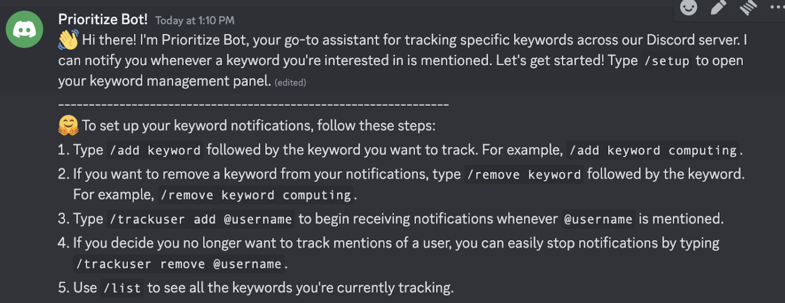
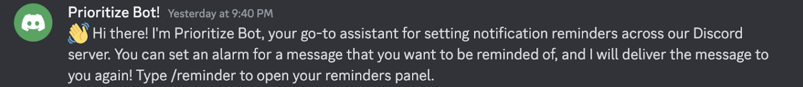

# Low Fidelity Prototype
Team Currently In Progress! : Jasmine Chi, Yitong Shan, Shreya Sathyanarayanan

## Prototype Components
What are the components?
The components of our low-fidelity prototype are a Discord server with channels for each of the tasks that Prioritize Bot, our Discord “Bot”, will be performing. We created three different channels, #keyword-user-notifications, #notification-alarms, and #bookmarks. The tasks of the Discord “Bot” were performed by one of our team members, who sent messages introducing the bot and possible message responses based on the commands that users can type.

Keyword Notifications: Users can use the Discord “Bot” to set specific keywords that they want to keep track of in Discord messages to help them prioritize their notifications. Users can view the messages with the specific keywords in the #keyword-user-notifications channel. The Discord “Bot” also provides users with the ability to keep track of messages where the users were mentioned using @[username].

Notification Alarms: Users can use the Discord “Bot” to set alarms on a message to help remind them to respond. Users can view the messages with notification alarms in the #notification-alarms channel. The user can specify a day and time for the alarm to deliver a reminder to respond to the message. Users can also add a comment to be displayed in the response reminder message when setting the notification alarm. The response reminder message can be viewed in the #notification-alarms channel.

Bookmarks: Users can use the Discord “Bot” to bookmark messages from specific users to view later, receive notification summaries from specific channels, and view reminder updates which appear when a user has responded to a message after setting a notification alarm. All bookmarked messages, channel notification summaries, and reminder updates can be viewed in the #bookmarks channel. The concept of the #bookmarks channel is to provide one place where users can view saved content and updates.

## Wizardry Aspects of Our Prototype

For the wizardry parts of our prototype, one of our group members will act as the “bot” and type the message out. Certain features such as finding keywords, summarizing a channel, and notification alarms are wizardry and we’re manually doing all of these things rather than having a bot actually do it.

## Screenshots of Prototype

Keyword/User Notification Bot

Keyword bot introduction message when you join the server:

Users can use /help for what features there are:

Users can add keyword (/add) or add the user (/trackuser) to track so they can be notified when they are mentioned:

Users can list the keywords and users that are currently being tracked by the bot:

Users can remove keyword (/remove keyword) or remove the user (/trackuser remove) to track so they can be notified when they are mentioned:

Notification Alarm Bot
Prioritize bot introduction message when you join the server:

Users can use /help for what features there are:

Set up an alarm for a specific message by replying that message with command /alarm add + date and time:

Users can check their reminders using the /remind command:

Users will get notifications at the set date and time:

Users can edit the reminder using /alarm edit by mentioning the reminder number and new date and time:

Users can remove the reminder by using /alarm remove and the reminder number:

Users can add comments to the reminde with /alarm commentr:

Bookmarks Bot
Prioritize bot introduction message when you join the server:

Users can use /help for what features there are:

Users can save messages for specific users using /bookmark user:

Users can receive notification summaries for a specific channel using /summaries:

Users can unsubscribe summaries from a channel by using /summaries remove:

Users can receive updates in ⁠bookmarks on which messages you have responded to after setting a notification alarm:

