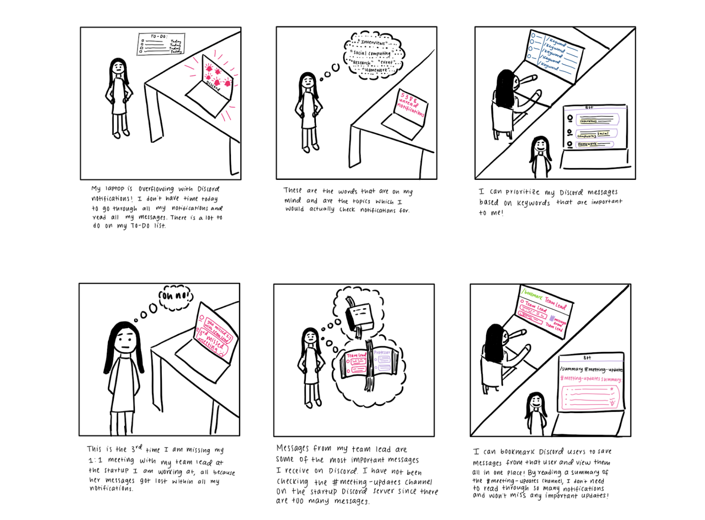
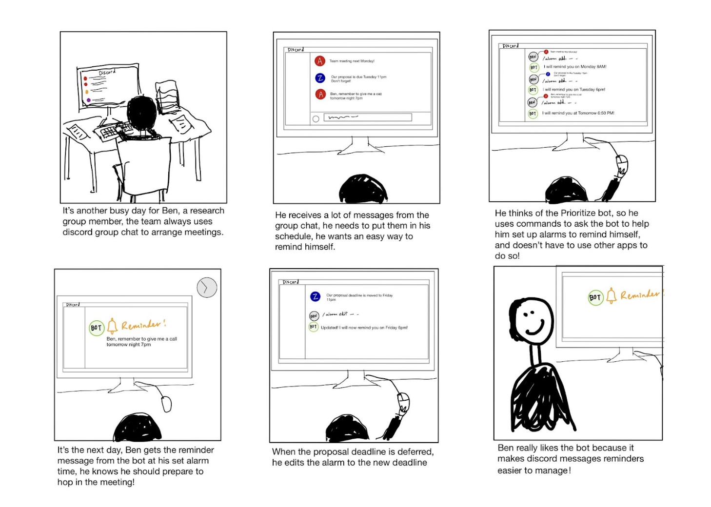
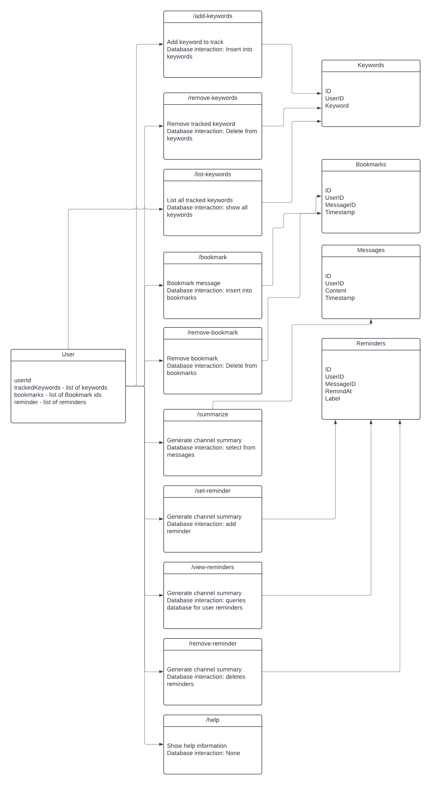

# Code and Design Specification

## Functional Requirements
### Primary Functionalities:
- Users will be able to add keywords to track in Discord messages and will be able to view those messages in the bot’s channel (/add <keyword>)
- Users will be able to remove keywords to track in Discord messages (/remove <keyword>)
- Users will be able to view a list of keywords added to track (/list)
- Users will be able to specify a channel and view the channel’s summary (/summarize #channel-name)
- Users will be able to bookmark messages from specific users (/bookmark username)
- Users will be able to stop bookmarking messages from specific users (/remove bookmark)
- Users will be able to view instructions to use the bot (/help)

### Secondary Functionalities:
- Users will be able to check their reminders list (/reminders)
- Users will be able to add reminders for messages with an alarm and label (reply to the message and type the command: /alarm add [month/day] [time] [label])  
- Users will be able to remove a reminder (/remove reminders), then it will display their list of reminders with their unique numbers, then choose the reminder number to remove (<number>)  

## Technical Requirements
### Primary Functionalities:
- Integration with Discord API for message tracking and interaction.
- A database for storing keywords, user preferences, bookmarked messages, and channel summaries.
- Use Discord permissions so that bot can only access certain channels and messages.

### Secondary Functionalities:
- Scheduling system for reminders
- Perhaps a database schema that supports storing, querying, and managing reminders, including unique identifiers for easy removal

## Usability Requirements
### Primary Functionalities:
- Intuitive and consistent commands so that users can easily memorize them as they use them and reduce the learning curve on users.
- Clear feedback from the bot such as error messages and success messages.
- Easy to follow commands/functionalities within the bot’s help command with examples for each functionality
### Secondary Functionalities:
- Simple and efficient process for managing their reminders like adding, viewing, and removing them.

## Storyboards
Scenario 1:  The user can view messages with set keywords and bookmark users and view all messages with keywords and bookmarked messages from a specific user all in one place:

Scenario 2: Set up alarm reminders from group messages

## Architectural Design
We’ll have notifications_bot.py that will contain our methods and event handlers in order to support our functionalities defined. This is an architectural outline of notifications_bot.py.

1. **init()** \
Description: Initializes the bot, setting up command handlers. 
2. **on_message(message)** \
Description: An event handler that triggers on every new message in the server to check for keywords.
3. **add_keyword(keyword)** \
Description: Allows users to add a keyword to their tracking list and updates the database. \
Parameters: 
    - keyword (str): The keyword to track.
4. **remove_keyword(keyword)**\
Description: Allows users to remove a keyword from their tracking list and updates the database.\
Parameters:
    - keyword (str): The keyword to stop tracking.
5. **list_keywords()**\
Description: Displays a list of all keywords the user is currently tracking.
6. **summarize(channel_name, num_messages)**\
Description: Summarizes the messages of the specified channel.\
Parameters:
    - channel_name (str): The name of the channel to summarize.
    - num_messages(int): The number of messages to summarize in the channel (ex: last 100 messages in the channel)
8. **bookmark_message(username)**\
Description: Bookmarks a specific user’s messages.\
Parameters:
    - username (str): The username whose message is to be bookmarked.
9. **remove_bookmark(username)**\
Description: Removes a bookmark of a specific user.\
Parameters:
    - username (str): The username whose bookmark is to be removed.
10. **help()**\
Description: Provides a help message with instructions on how to use the bot.
11. **reminders_list()**\
Description: Lists all the active reminders set by the user.
12. **add_reminder(month, day, time, label)**\
Description: Adds a reminder for the user with a specified alarm and label.\
Parameters:
    - month (int): The month for the reminder.
    - day (int): The day for the reminder.
    - time (str): The time for the reminder.
    - label (str): A label for the reminder.
13. **remove_reminder(reminder_id)**\
Description: Removes a reminder based on its unique ID.\
Parameters:
    - reminder_id (int): The unique identifier of the reminder to remove.

## How our system description enables the requirements described
Our system enables the functionalities we described in our requirements as each functionality is addressed by one of our methods in our system’s architectural design. For our technical requirements, we plan to use the features of the Discord interface along with the discord.py library to be able to track new messages received and manage the different messages and channels. We are hoping that this integration will provide the user-friendly experience that users on Discord expect from our functionalities. Our primary function requirements also directly relate to our storyboards since the functionalities of our bot and the methods it would have directly address how the user would interact with the bot like bookmarking a Discord user to track messages or setting reminders to go back and look at a certain message. In turn all of these features would help users be able to manage their notifications and prioritize them in a more personalized way!
