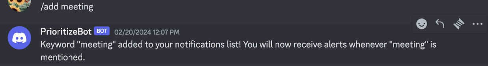
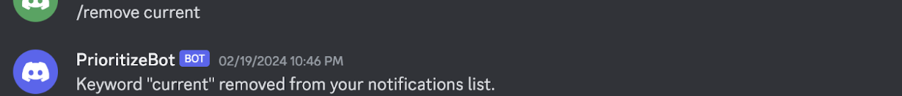
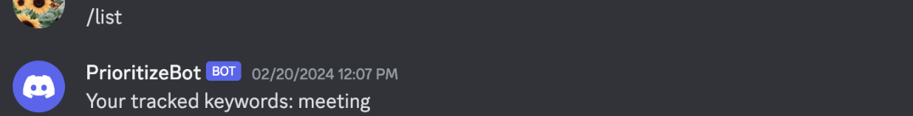
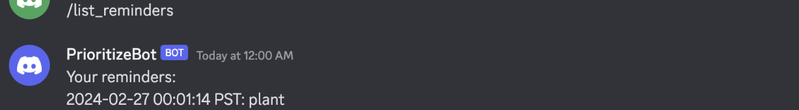
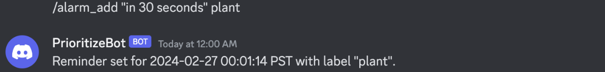
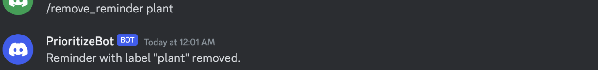

# User Testing
Team Currently In Progress! : Jasmine Chi, Yitong Shan, Shreya Sathyanarayanan

## Medium-fidelity Prototype
We implemented two functionalities, keyword tracker and alarm reminder. Users can add and remove keywords anytime using the command. If they forget, they can ask the bot to send the command descriptions again, we modified them into briefer and shorter descriptions. Our Discord bot, PriotizeBot, can automatically track the messages that contain the added keywords, and send them to the user by direct messages. Our other functionality is to set up alarms for messages, such as adding a specific message and a time, and the bot will automatically alarm the reminder to the user at the time. Users can add labels to track and identify each reminder.

The code can be found [here](https://github.com/UWSocialComputing/Currently-in-progress-code/blob/main/src/discordbot/bot.py).
Screenshots
List all commands (/showhelp)

Keyword Tracker:
Add keywords to track in Discord messages and will be able to view those messages in the bot’s channel (/add <keyword>)

Users will be able to remove keywords to track in Discord messages (/remove <keyword>)

Users will be able to view a list of keywords added to track (/list)

Alarm reminder:
check their reminders list (/list_reminders)

Add a reminder for a specific time with a label (/alarm_add "time" "label")  

Remove a reminder by its label (/remove_reminder "label)

Users will be able to add an alarm reminder for responding to specific Discord messages and PrioritizeBot will send the user a direct message as a reminder to respond to the message with an alarm.

## Findings from User Testing:
During the user testing sessions, we were able to understand which aspects and features of our prototype were intuitive and which needed more context for the user. For example, the adding keywords feature was intuitive for users and the functionality was relevant and understandable. However, since PrioritizeBot has multiple commands with specific formatting guidelines, users felt that seeing examples of how these commands are used would be helpful. The bot commands can also be introduced when the user first uses the bot. Users also thought figuring out how to set a bot reminder to respond to a message was challenging. A common challenge was figuring out how to format the time when setting a reminder. Users also mentioned that color-coding or highlighting would be helpful to understand the different types of messages PrioritizeBot sends users. The concepts of alarms and reminders were compared since a reminder is more intuitive for reminding a user to respond to messages than an alarm. Users did mention that the functionality of the reminder feature was easy to understand and is one that they would find helpful and use when receiving many notifications. Users prefer that the commands to PrioritizeBot be visible to only the user rather than everyone in the channel. 

Overall, we will continue to develop four features for our bot: tracking keywords in messages, setting reminders to respond to messages, bookmarking users to track messages from specific users to ensure that important notifications are not missed, and providing channel summaries. We will be adding a new bot command that provides users with examples of formatting and how to use the different commands. For the keyword feature, we can add the username and channel name details of the message the bot finds with the keyword when sending it to the user. We will be fixing the time formatting options to be more simple in the response reminder feature. We will be looking into how to make Discord bot commands visible only to the user rather than everyone in the channel since that will help improve user experience. 

The next functionalities we will be implementing in our prototype are the bookmark feature and channel summarization. In addition to bookmarking messages that a specific user sends, we will work on bookmarking messages that also mention the specific user. For the channel summarization feature, we will be setting a limit for how many messages the user wants to summarize, such as summarizing the last 50 messages in the channel. 

