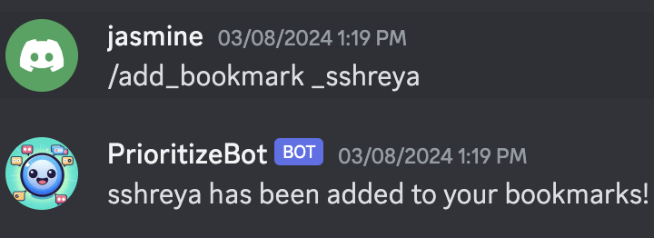
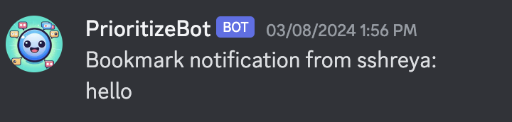
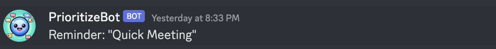

# Digital Prototype
## Problem Space

Many young adults and college students are often interrupted from their daily tasks by notifications with the increased reliance on chat rooms for personal and academic purposes. It is important to understand how chat apps affect the productivity of students, their sense of community, and their overall perception of online interactions. There are currently no features that allow for nuanced control over notification management or an easy way to prioritize notifications. In the experiences of many users, when they receive a notification, they either immediately respond to it or read it and then leave it for later to respond if it is not urgent. We are exploring how to improve interactions with notifications and chat experiences to impact productivity and connectivity in young adults.

## Our Solution: PrioritizeBot! 
Our solution is PrioritizeBot, a Discord bot that helps users prioritize notifications based on important keywords, set reminders to respond to messages, bookmark messages from specific users, and view channel summaries. PrioritizeBot allows for nuanced control of Discord notifications through personalization and helps users prioritize notifications without missing important updates!

### Keyword Tracker
The Keyword Tracker feature allows users to add and remove keywords to track in Discord messages. For example, let’s consider that the user receives many notifications on Discord across different servers and channels and is currently working on a Social Computing research project that needs to be completed over the next week. Over the next week, the user does not want to miss any notifications that contain the keywords “Social Computing” and “research”. When the user uses the command to add a keyword, PrioritizeBot will notify the user that the specific keyword has been added in the channel. The user can also view the list of added keywords in their private channel. The keyword tracking feature can help users to better filter important messages when they receive a lot of notifications, many of which are not relevant.

When someone mentions the word you are tracking in any of the channels, PrioritizeBot will directly DM you the message the user sent and which channel they sent it in.

### Bookmarking Users

The Bookmarks feature allows users to create and remove bookmarks for specific users. Users can add bookmarks to specific users and remove the bookmarks in their private Discord channels. When a bookmarked user sends a message on Discord, the user will be notified of the message through a direct message, which helps users keep track of messages from important people.

When the user you bookmarked sends a message to the server, PrioritizeBot will DM you the bookmarked user’s message directly.

### Message Response Reminders

The Message Response Reminder feature helps users with being reminded to respond to messages on Discord. Many Discord users receive so many messages that they often need a reminder to respond. Users can set a reminder alarm to respond to specific messages and create a label for the reminder in the private channel. When it is time for the reminder alarm, PrioritizeBot will notify the user with a reminder message through direct messaging. Users can track the list of reminders they have created and each reminder will be labeled with a description.

The reminder will then be sent via Discord DM.

### Channel Summaries

PrioritizeBot’s Channel Summaries feature allows users to view summaries of Discord channels and specify how many messages to summarize. For example, users can use the summarize command to receive a summary of the last 100 messages in the channel. The channel summaries feature helps users easily understand the updates in a Discord channel and they do not need to spend time scrolling through and reading so many messages to catch up on important updates. 

## Implementation, Technical Details, and Issues

PrioritizeBot is built using Python using the discord.py library where it uses asynchronous programming to handle the tasks and direct messages to the user. The bot's functionalities are divided into modules, each responsible for a specific feature set, such as managing reminders or processing keyword notifications.

Here’s a high-level overview of each functionality:

- **Keyword Tracker**: Implemented using a dictionary to store user-specific keywords and a listener that basically scans messages across channels for these keywords that the user set.
- **Bookmarking Users**: Store user bookmarks, allowing users to save and retrieve important messages from certain users. 
- **Message Response Reminders**: We used the dateparser library to understand dates and times the user might enter and schedule reminders that are stored in MongoDB. We use an asynchronous loop to “trigger” it.
- **Channel Summaries**: Made use of the OpenAI's GPT-3 API to generate summaries of discussions in a channel that the user would enter.
Private Channel Creation: Created private channels for users and restricted the permissions on these so that they can interact with the bot privately.

One of the issues that we ran into later on after user testing was that all of the bot interaction was through a public channel accessible and visible to everyone. This made sense during the prototyping and testing phase but we realized that when users actually use this, they probably do not want other users on the server seeing what they are setting as their keywords, message response reminders, or bookmarks. Because of this, we added a new bot command so that users can create their own private channel with the bot where they can interact with it without others seeing it.

## Try PrioritizeBot!
Let PrioritizeBot help you manage your Discord notifications! Our repo can be found [here](https://github.com/UWSocialComputing/Currently-in-progress-code/blob/main/src/discordbot/bot.py) :)