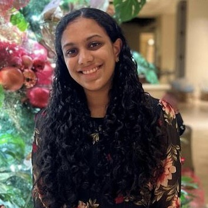

## Welcome to Prioritize Bot!

## So you might be wondering, what is Prioritize Bot about?
These days, many young adults and college students are often interrupted from their daily tasks by smartphone notifications. With the increased reliance on mobile technologies for personal and academic purposes, it's important to understand how smartphone notifications and chat apps affect the productivity of students, sense of community, and overall perception of online interactions. There is currently no features that allow for nuanced control over notification management or an easy way to prioritize notifications. In many users’ experiences, when they receive a notification, they either immediately respond to it or read it and then leave it for later to respond if it is not urgent. This quarter, we explored how to improve interactions with notifications and chat experiences impact productivity and connectivity in young adults and created Prioritize Bot!

Prioritize Bot is a Discord bot that helps users prioritize notifications based on important keywords, set reminders to respond to messages, bookmark messages from specific users, and generate channel summaries. It allows for nuanced control of Discord notifications through personalization and allows users prioritize notifications without missing the important updates in their lives :)

Intrigued? Or even just slightly interested? Then come try out [Prioritize Bot](https://github.com/UWSocialComputing/Currently-in-progress-code)!

## Meet our Team :D

<table>
<tr>
  <td align="center">
     
    <strong><a href="https://www.linkedin.com/in/jjasminechii/">Jasmine Chi</a></strong>
  </td>
  <td align="center">
     
    <strong><a href="https://www.linkedin.com/in/yitong-shan/">Yitong Shan</a></strong>
  </td>
  <td align="center">
     
    <strong><a href="https://www.linkedin.com/in/shreya-s-427807202/">Shreya Sathyanarayanan</a></strong>
  </td>
</tr>
</table>

## Blog Posts!

* [User Research Report](/G1.md)
* [Pitch Presentation](/G2.md)
* [Low Fidelity Prototype](/G3.md)
* [Code and Design Specification](/G4.md)
* [Midterm Presentation](/G5.md)
* [User Testing](/G6.md)
* [Digital Prototype](/G7.md)
* [Video Demo](/G8.md)